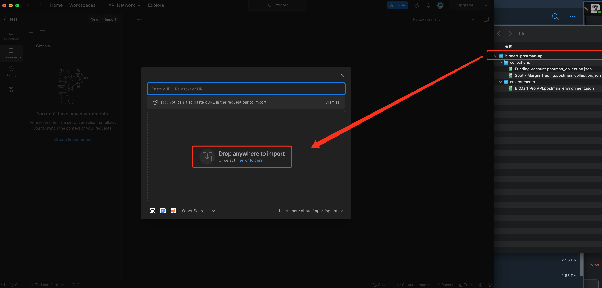
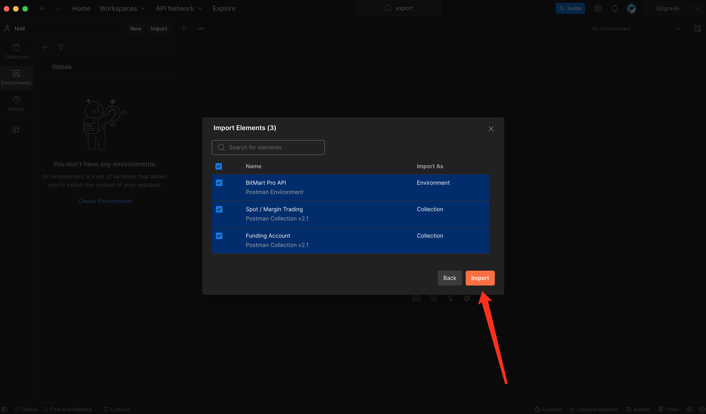
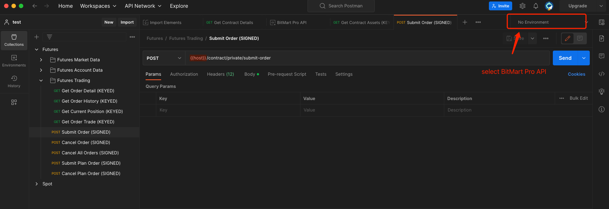
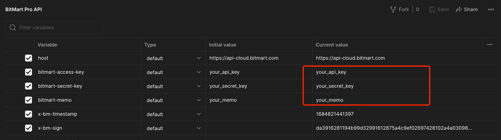

# BitMart Postman API
[Postman](https://getpostman.com) is an API Collaboration Platform.

## How to import and configure
* Step1: Download the `bitmart-postman-api` repository.
    
* Step2: Open the postman software on the computer and create a new workspace.
    

    

- Step3: In the new workspace project, find the `import` button and click it.
    

    
    
- Step4: Unzip the downloaded git project, then drag the entire project to the imported area.
    

    

- Step5: Find the `Environments` tab and fill in your API KEY.
    

- Step6: Find the `Collections` tab, select environment configuration name `BitMart Pro API`, 
    and finally select any request and click the corresponding send button to complete a request call.
    

  
## FAQ

#### 1. How can I debug a request or find the used URL?
Open the Postman's console to find requests' parameters and URL.
Debugging can be done by editing the Pre-request Script tab.

#### 2. Error Header X-BM-KEY not found
1. no choice environment, plz select `BitMart Pro API` environment
2. API key is not set in `BitMart Pro API` environment
3. API key is not correct.
  

#### 3. Error Header X-BM-SIGN wrong.
1. no choice environment, plz select `BitMart Pro API` environment
2. API key is not set in 
3. API key or secret key or memo is not correct.
  

